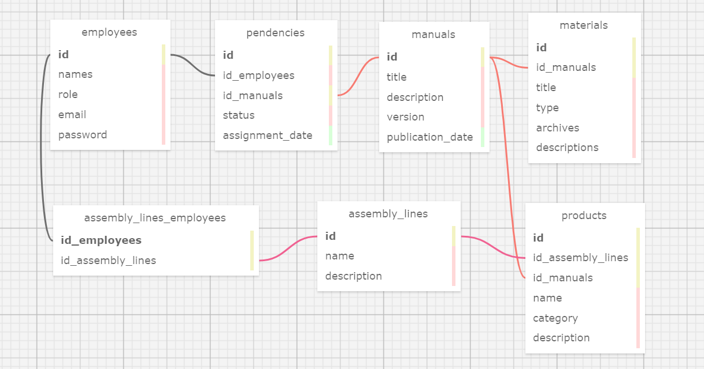

<div align="center">

</div>

<h1 align="center">Modelagem do Banco de Dados</h1>


## Contexto
&nbsp;&nbsp;&nbsp;&nbsp;A modelagem de banco de dados foi realizada para o desenvolvimento da solução "Edellcation", uma aplicação _web_ de treinamento projetada para divulgar e disponibilizar materiais técnicos (manuais) relacionados ao processo de montagem de diferentes produtos da empresa Dell. Dessa forma, a modelagem atua na estruturação e organização dos dados necessários para a aplicação, fornecendo uma base sólida para seu funcionamento eficiente. As ferramentas utilizadas para a construção do banco de dados incluem _Render_, que oferece serviço de nuvem para hospedagem de aplicações, e _DBeaver_, uma ferramenta de administração de banco de dados. Além disso, o banco de dados foi desenvolvido de acordo com o SGBD (Sistema de Gerenciamento de Banco de Dados) PostgreSQL.

## Modelagem do Banco de Dados
&nbsp;&nbsp;&nbsp;&nbsp;No contexto do projeto, a modelagem referida por esta explicação (Figura 1), desenvolvida por meio do software _SQL Designer_, representa um diagrama de como os dados vão fluir para dentro e para fora do banco de dados, estabelecendo relações entre as entidades. Tem-se, então, a retratação da modelagem:

<div align="center">
<sub>Figura 1 - Modelagem de banco de dados </sub>

<sup>Fonte: Material elaborado pela autora em software SQL Designer (2024).</sup>
</div>

[Modelagem de banco de dados em PDF.](assets/modelagem.pdf)

[Arquivo Modelagem de banco de dados (XML).](assets/modelagem.xml)

## Código SQL
&nbsp;&nbsp;&nbsp;&nbsp;Conforme a linguagem de consulta estruturada (SQL), padrão para criação e manipulação de bancos de dados, o código a seguir se refere ao banco de dados criado para o projeto.

```sql
DROP TABLE IF EXISTS employees;

CREATE TABLE employees (
  id SERIAL PRIMARY KEY,
  names VARCHAR(100),
  role VARCHAR(10),
  email VARCHAR(100),
  password VARCHAR
);

DROP TABLE IF EXISTS pendencies;

CREATE TABLE pendencies (
  id SERIAL PRIMARY KEY,
  id_employees INTEGER REFERENCES employees(id),
  id_manuals INTEGER,
  status VARCHAR(20),
  assignment_date DATE
);

DROP TABLE IF EXISTS manuals;

CREATE TABLE manuals (
  id SERIAL PRIMARY KEY,
  title VARCHAR(200),
  description VARCHAR(400),
  version VARCHAR(20),
  publication_date DATE
);

DROP TABLE IF EXISTS materials;

CREATE TABLE materials (
  id SERIAL PRIMARY KEY,
  id_manuals INTEGER REFERENCES manuals(id),
  title VARCHAR(200),
  type VARCHAR(100),
  archives VARCHAR,
  descriptions VARCHAR(400)
);

DROP TABLE IF EXISTS products;

CREATE TABLE products (
  id SERIAL PRIMARY KEY,
  id_assembly_lines INTEGER,
  id_manuals INTEGER REFERENCES manuals(id),
  name VARCHAR(200),
  category VARCHAR(50),
  description VARCHAR(400)
);

DROP TABLE IF EXISTS assembly_lines;

CREATE TABLE assembly_lines (
  id SERIAL PRIMARY KEY,
  name VARCHAR(50),
  description VARCHAR(400)
);

DROP TABLE IF EXISTS assembly_lines_employees;

CREATE TABLE assembly_lines_employees (
  id_employees INTEGER,
  id_assembly_lines INTEGER,
  PRIMARY KEY (id_employees)
);

ALTER TABLE pendencies ADD FOREIGN KEY (id_employees) REFERENCES employees(id);
ALTER TABLE pendencies ADD FOREIGN KEY (id_manuals) REFERENCES manuals(id);
ALTER TABLE materials ADD FOREIGN KEY (id_manuals) REFERENCES manuals(id);
ALTER TABLE products ADD FOREIGN KEY (id_assembly_lines) REFERENCES assembly_lines(id);
ALTER TABLE products ADD FOREIGN KEY (id_manuals) REFERENCES manuals(id);
ALTER TABLE assembly_lines_employees ADD FOREIGN KEY (id_employees) REFERENCES employees(id);
ALTER TABLE assembly_lines_employees ADD FOREIGN KEY (id_assembly_lines) REFERENCES assembly_lines(id);
```

## Explicação
&nbsp;&nbsp;&nbsp;&nbsp;Tendo como objetivo o desenvolvimento de uma solução para os processos de treinamento nas fábricas de montagem da Dell, o banco de dados foi estruturado para armazenar informações sobre funcionários, materiais técnicos, produtos, linhas de montagem e suas interações.

### Tabelas do Banco de Dados:

1. **employees (funcionários):**
   - Esta tabela armazena informações sobre os funcionários da empresa Dell envolvidos no processo de treinamento e montagem de produtos.
   - Campos:
     - `id`: Identificador único do funcionário (chave primária).
     - `names`: Nomes do funcionário.
     - `role`: Cargo ou função do funcionário.
     - `email`: Endereço de e-mail do funcionário.
     - `password`: Senha do funcionário (considerações de segurança devem ser implementadas).

2. **manuals (manuais):**
   - Esta tabela mantém os detalhes dos manuais técnicos que descrevem os processos de montagem dos produtos Dell.
   - Campos:
     - `id`: Identificador único do manual (chave primária).
     - `title`: Título do manual.
     - `description`: Descrição do conteúdo do manual.
     - `version`: Versão do manual.
     - `publication_date`: Data de publicação do manual.

3. **pendencies (pendências):**
   - Esta tabela registra as pendências atribuídas aos funcionários para revisar ou concluir os manuais de treinamento.
   - Campos:
     - `id`: Identificador único da pendência (chave primária).
     - `id_employees`: ID do funcionário associado à pendência (chave estrangeira para `employees`).
     - `id_manuals`: ID do manual relacionado à pendência (chave estrangeira para `manuals`).
     - `status`: Estado atual da pendência.
     - `assignment_date`: Data de atribuição da pendência.

4. **materials (materiais):**
   - Esta tabela armazena informações sobre os materiais técnicos que acompanham os manuais, como vídeos, imagens ou documentos adicionais.
   - Campos:
     - `id`: Identificador único do material (chave primária).
     - `id_manuals`: ID do manual ao qual o material está associado (chave estrangeira para `manuals`).
     - `title`: Título do material.
     - `type`: Tipo de material (vídeo, imagem, documento, etc.).
     - `archives`: Arquivos relacionados ao material.
     - `descriptions`: Descrição do material.

5. **products (produtos):**
   - Esta tabela contém informações sobre os produtos Dell que estão sendo montados, juntamente com os manuais e linhas de montagem associadas.
   - Campos:
     - `id`: Identificador único do produto (chave primária).
     - `id_assembly_lines`: ID da linha de montagem associada ao produto (chave estrangeira para `assembly_lines`).
     - `id_manuals`: ID do manual de montagem do produto (chave estrangeira para `manuals`).
     - `name`: Nome do produto.
     - `category`: Categoria do produto.
     - `description`: Descrição do produto.

6. **assembly_lines (linhas de montagem):**
   - Esta tabela mantém detalhes sobre as linhas de montagem onde os produtos Dell são montados.
   - Campos:
     - `id`: Identificador único da linha de montagem (chave primária).
     - `name`: Nome da linha de montagem.
     - `description`: Descrição da linha de montagem.

7. **assembly_lines_employees (funcionários das linhas de montagem):**
   - Esta tabela registra a associação entre os funcionários e as linhas de montagem onde estão designados.
   - Campos:
     - `id_employees`: ID do funcionário associado à linha de montagem (chave estrangeira para `employees`).
     - `id_assembly_lines`: ID da linha de montagem associada ao funcionário (chave estrangeira para `assembly_lines`).

### Conexões (Foreign Keys):

- A tabela `pendencies` possui chaves estrangeiras para as tabelas `employees` e `manuals`, permitindo que cada pendência seja atribuída a um funcionário específico e relacionada a um manual específico.
- A tabela `materials` possui uma chave estrangeira para a tabela `manuals`, garantindo que cada material esteja associado a um manual específico.
- A tabela `products` possui chaves estrangeiras para as tabelas `assembly_lines` e `manuals`, permitindo que cada produto esteja associado a uma linha de montagem específica e a um manual de montagem específico.
- A tabela `assembly_lines_employees` possui chaves estrangeiras para as tabelas `employees` e `assembly_lines`, garantindo que cada funcionário esteja associado a uma linha de montagem específica e vice-versa.

&nbsp;&nbsp;&nbsp;&nbsp;Essa estrutura de banco de dados visa facilitar o gerenciamento e a organização dos materiais de treinamento, bem como acompanhar o progresso dos funcionários no processo de montagem dos produtos Dell em diferentes linhas de montagem.
